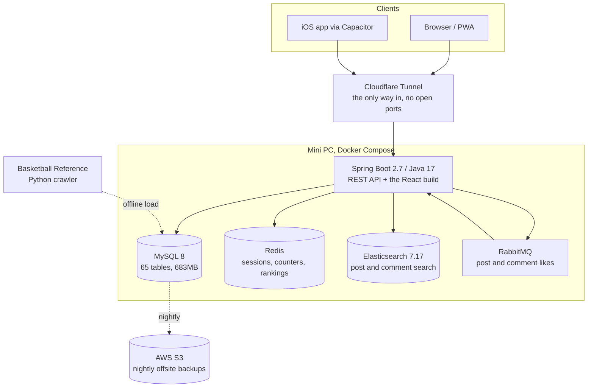

# Dream Everything

A full-stack site I built and run on my own, live at **[dream-everything.com](https://www.dream-everything.com)**.

It started in January 2024 as a place for me and a few friends to post, and it grew into the project where I try
things I don't get to try at work: an NBA statistics database with over a million rows, web push, an iOS build,
backups to S3, and a bilingual interface. Around 53,000 lines of code so far, all of it written by me.

Java 17 + Spring Boot on the back, React 19 on the front, MySQL, Redis, RabbitMQ and Elasticsearch behind it,
running in Docker on a mini PC at home.

---

## What's in it

| Module | What it does |
|---|---|
| **Forum** | Topics with their own membership and permissions, posts, comments and nested replies, likes, favourites, polls, star ratings, tags, group chat, file sharing, full-text search |
| **NBA stats** | 50 seasons of players, teams, games, box scores, playoffs, draft history, career totals, leaderboards and player comparison |
| **LoL records** | Match history pulled from the Riot API for a small group of players |
| **Schedule** | Personal calendar with deadlines, repeating tasks and 8am reminders |
| **Messaging** | Private messages, a notification centre, and browser push |
| **Payroll** | A small tool a friend uses to track shifts and settle wages for a food stall |
| **Admin** | User roles, per-user feature switches, ban and mute controls, player data editing |

The whole interface switches between Chinese and English.

---

## Architecture



The React app is built with Vite and served as static files by the same Spring Boot process, so there is one
container to deploy and no CORS to manage in production.

---

## Tech stack

**Backend** Java 17, Spring Boot 2.7, MyBatis-Plus, Spring Session (Redis-backed), WebSocket/STOMP for live
private messages, RabbitMQ, Elasticsearch, MySQL 8, scheduled jobs, AOP, web push over VAPID

**Frontend** React 19, Vite 8, Ant Design 5, React Router, i18next, service worker (PWA), Capacitor for iOS

**Infrastructure** Docker Compose, Cloudflare Tunnel, AWS S3 and IAM, Uptime Kuma, systemd timers,
Python 3 for the data pipeline

---

## Parts worth a look

**The NBA data pipeline** (`tools/nba_sync/`)
A Python crawler pulls Basketball Reference season by season, normalises names and team codes, and loads MySQL.
It currently holds **1.21M box-score rows across 59,275 games from 1976 to 2026**, plus playoffs by round and by
game, 8,443 draft picks and 4,907 players. Career and season aggregates are computed once into their own tables,
so a player page reads a single row instead of grouping a million.

**Running it in production**
The site is reachable through a Cloudflare Tunnel, so the machine has no inbound ports open at all. MySQL is
dumped nightly, verified (a truncated dump that still opens is the failure mode worth catching), then synced to
S3 with an IAM key that has no delete permission. I ran a restore drill and measured it: 24 hours of data at
risk, two minutes to recover.

**Finding the real bottleneck** (`src/main/resources/application-ubuntu.yml`)
The stats pages felt slow and I assumed it was SQL. It was not. One endpoint was sending 2.89MB of uncompressed
JSON while its query took 17ms, and the tunnel was carrying all of it. Turning on gzip in the app cut that hop to
roughly 390KB.

**Chinese to English without renaming a thousand strings** (`frontend/src/i18n.js`)
The Chinese source text is the translation key, so `t('得分')` reads the same as the original code and needs no
lookup table to understand. To retrofit it across the frontend I wrote an AST codemod rather than editing by
hand, with rules for the cases a naive pass gets wrong: values compared with `===`, strings that are written to
the database, CSS inside `<style>` blocks, and local variables that happen to be named `t`. About 1,250 strings
are translated so far.

**Permissions**
Roles, per-user feature switches and per-topic membership are combined in one place, and there is a
single-session limit so one account cannot be shared. Sessions live in Redis, so a deploy does not log anyone out.

---

## Running it locally

You need JDK 17, Node 20+, and Docker.

```bash
# 1. dependencies: MySQL, Redis, RabbitMQ, Elasticsearch
docker compose -f docker-compose.dev.yml up -d

# 2. configuration. The defaults already match the dev compose file, so for a
#    local run you can copy it and change nothing.
cp .env.example .env

# 3. frontend
cd frontend && npm install && npm run dev     # http://localhost:5173

# 4. backend
./mvnw spring-boot:run -Dspring-boot.run.profiles=local   # http://localhost:8080
```

One extra step for search: the post and comment indices are mapped with the IK Chinese analyzer, so
Elasticsearch needs that plugin before the app first creates them. Download the `analysis-ik` release matching
7.17.16 and unzip it into `./es-plugins/analysis-ik/`, then start the stack.

The schema lives in `src/main/resources/mybatis/` alongside the mappers. The NBA tables are optional; without
them the forum still runs, the stats pages are just empty.

To build the way production does, which is one jar with the frontend inside it:

```bash
cd frontend && npm run build
cp -R frontend/dist/. src/main/resources/static/
./mvnw clean package -DskipTests
```

---

## Repo layout

```
src/main/java/com/dream/basketball/
    controller/    REST endpoints
    impl/          service implementations
    mapper/        MyBatis mappers
    entity/ dto/   persistence and transfer objects
    job/           scheduled jobs (schedule reminders, LoL sync)
    config/        permissions, interceptors, RabbitMQ, Elasticsearch
src/main/resources/mybatis/   hand-written SQL
frontend/src/
    pages/         one folder per module
    components/    shared UI
    api/           axios wrappers
    locales/en.json  the English side of the interface
tools/nba_sync/    Python crawler and loaders
```

---

## Notes

Nothing sensitive is committed here. Passwords, API keys and tokens all come from environment variables at
runtime, and `.env.example` lists the ones the app looks for.

This is a personal project rather than a product. The live site holds real posts from people I know, so there is
no database dump in this repository.
